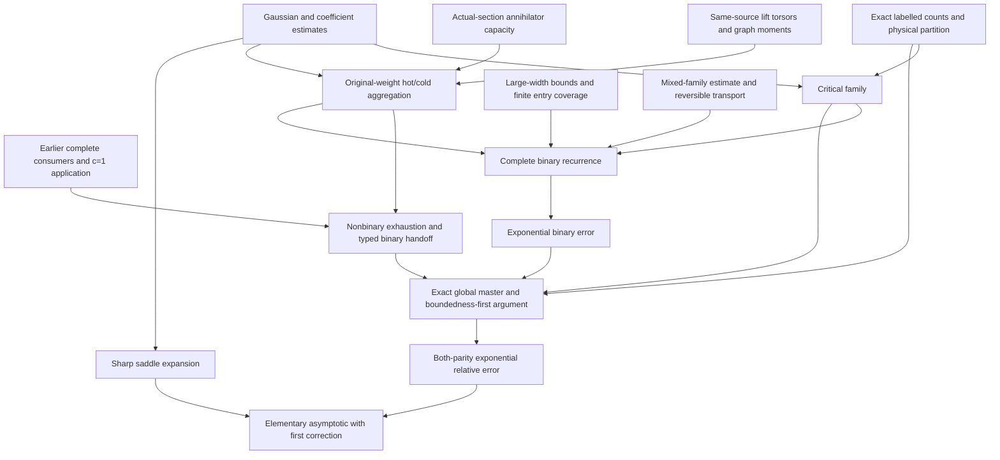

# Mathematical proof blueprint

This is the theorem-level map of the mathematical argument. Each implication
uses the named component lemmas and their scope hypotheses. The dependency
diagram and interface statements are not themselves proofs or certificates.

The [manuscript reading guide](MANUSCRIPT_ROUTE.md) gives the selected proof
order and the complete final partition.

Read the [target specification](../../SPEC.md), then the following components:

1. [Counting, critical model and global assembly](COUNTING_AND_ASSEMBLY.md).
2. [Common-source capacity, fusion and complete binary control](CAPACITY_AND_BINARY.md).
3. [Global components and terminal attachment](GLOBAL_COMPONENTS.md).
4. [Analytic coefficient estimates and explicit corollaries](ANALYTIC_COROLLARIES.md).
5. [Finite certificates and their mathematical scope](FINITE_CERTIFICATES.md).
6. [Published-input inventory](../../provenance/LITERATURE.md).

## Dependency spine

The coarse published subgroup bound is an independent input to hot-moment
estimates. The sharp subgroup asymptotic is never used in those estimates.
Basic coefficient estimates enter the counting proof before the final analytic
corollaries; their proofs do not depend on the subgroup asymptotic.

## Stable claim identifiers

| ID | Statement/interface | Immediate mathematical dependencies |
|---|---|---|
| DEF-COUNT | Actual labelled subgroup counts, exact L_n, complete binary F_N/E_N | Finite group and vector-space definitions |
| CNT-WEIGHT | Exact normalizer and occurrence-factorial weights | Orbit-stabilizer and recovered actual orbits |
| ANA-GAUSS | Gaussian subspace totals and their exponentially accurate theta equivalent | Gaussian product formula; summable tails |
| ANA-COEF | Positive coefficient recurrence, fixed-shift ratios and quartic coefficient comparison | Exact exponential generating function; independent coefficient analysis |
| CRT-MODEL | Complete critical family, both parity markers, canonical main term and exceptional-lift error | CNT-WEIGHT, ANA-GAUSS, ANA-COEF, specified action and normalizer calculations, quadratic lift fibre |
| CNT-LIFT | Conditional cocycle bound above one fixed quotient map | Inflation-restriction, actual Sylow/normalizer, published abelian p-quotient bound |
| CNT-GRAPH | Injective encoding of tuples of maps from the same source | Actual permutation covers and quotient maps |
| CAP-SECTION | Coupled fixed/nontrivial socle bound and retained-annihilator cut | Actual-section module bounds, nonbinary trivial-section budget |
| CNT-FUSION | Original-weight hot/cold scalar and forward kernel | CNT-LIFT, CNT-GRAPH, ANA-GAUSS, ANA-COEF, independent coarse subgroup bound |
| APP-C1 | Exact surviving-character/inverse-complement interface and high-c1 exhaustion | Relative ternary filtration, earlier complete consumers and primitive inputs |
| NB-EXHAUST | Every remaining selected nonbinary orbit is accepted; one typed binary handoff remains | CAP-SECTION, CNT-FUSION, earlier alphabet reduction, APP-C1, marker collapse |
| BIN-LARGE | Complete width-at-least-32 binary reduction, with growing-width entropy paid | Binary separators, width32/top16 and width64/top32 boundaries, CNT-FUSION |
| BIN-MIX | Complete C4/carrier/critical mixed family, with support-sensitive reserves | Retained-factor splitting, joint mixed subgroup bounds, original profile coefficients |
| BIN-TRANSPORT | Reversible simultaneous full-preimage transport and decoration bound | BIN-MIX profile reserves, literal common-quotient maps, positive retained support |
| FIN-MENU | Every small-width action/normal entry has a strict certificate or replacement | Generic regular case; complete finite coverage; literal local charts |
| BIN-SMALL | Complete small-width hot/cold/transport partition | FIN-MENU, CNT-FUSION, BIN-TRANSPORT |
| BIN-ERROR | E_N=O(2^(-aN)) for the complete noncritical binary family | CRT-MODEL, BIN-LARGE, BIN-SMALL, boundedness-first recurrence |
| ASM-OLD | Exact old scalar sum and inherited forward aggregate | Every active consumer, its scope and its quantitative rate |
| ASM-MAIN | Exact exhaustive both-parity master inequality | CNT-WEIGHT, CRT-MODEL, APP-C1, NB-EXHAUST, ASM-OLD, BIN-ERROR |
| THM-MAIN | s_n/L_n=1+O(2^(-cn)), uniformly in parity | ASM-MAIN, boundedness-first induction, critical lower family |
| ANA-SADDLE | Exact-saddle coefficient formula with relative O(1/n) remainder | Independent central/minor-arc estimates |
| ANA-EXPLICIT | Four residue-class constants and first elementary correction | ANA-GAUSS, ANA-SADDLE, Stirling expansion |
| THM-EXPLICIT | Exact-saddle and elementary formulas for the total subgroup count | THM-MAIN, ANA-SADDLE, ANA-EXPLICIT |

The word "complete" in BIN-ERROR and ASM-MAIN is essential. The binary target
includes groups accepted by earlier binary estimates. The source
partition pays the relevant original families once, even when a common
auxiliary estimate bounds more than one of them.
